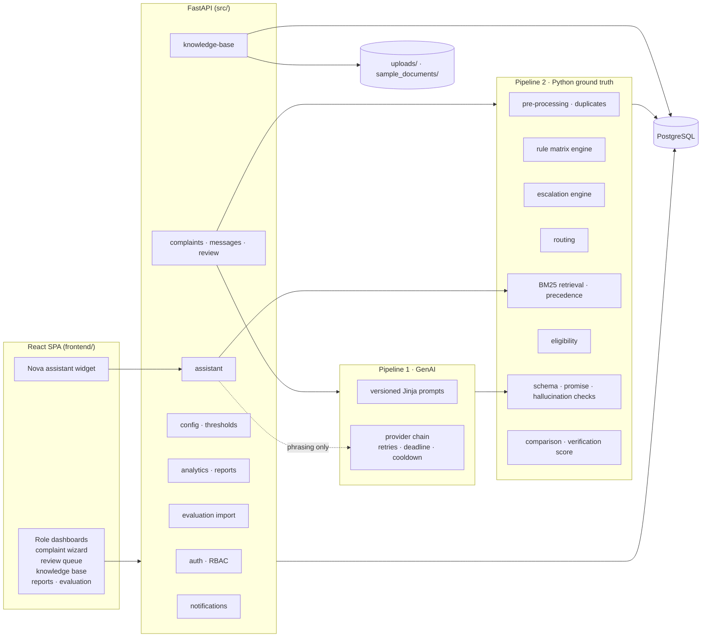
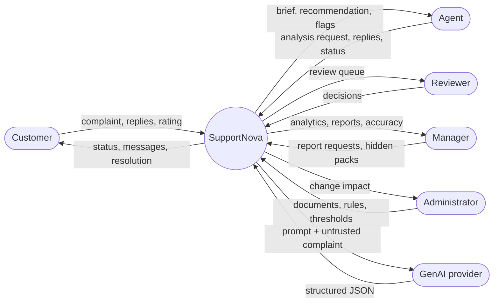
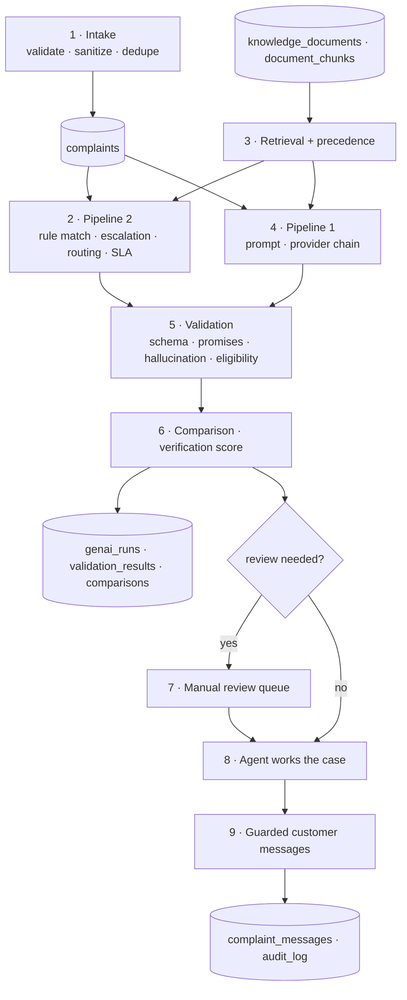
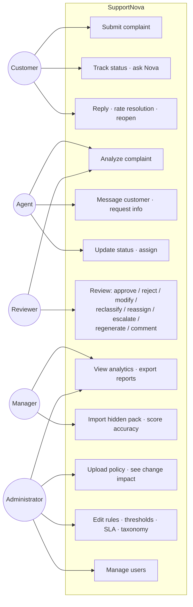
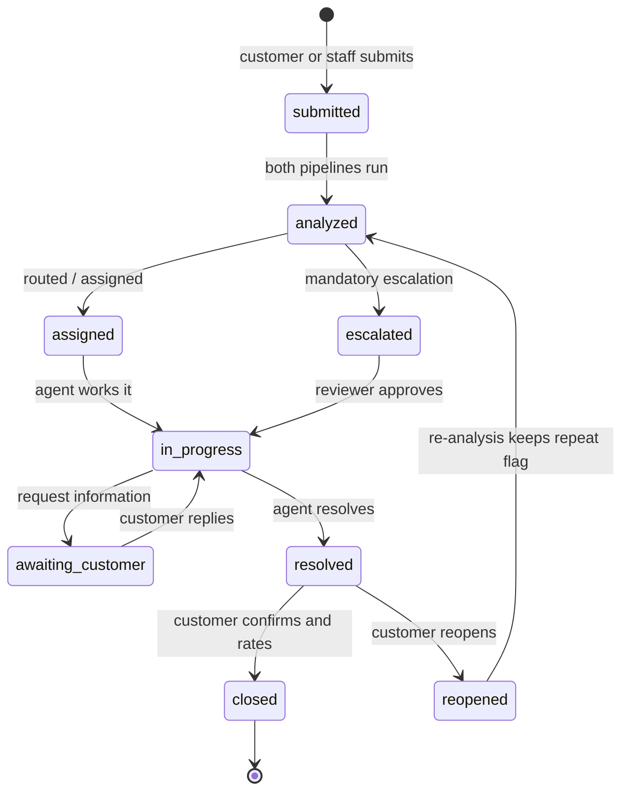
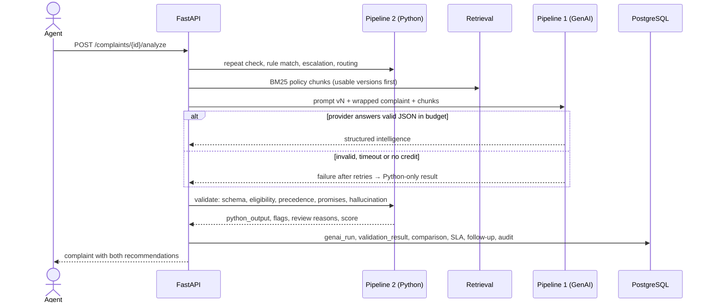
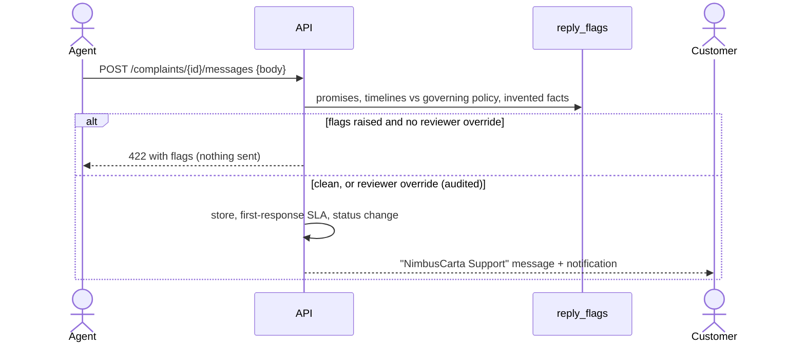
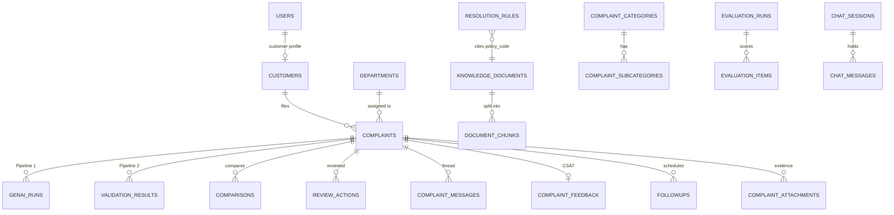
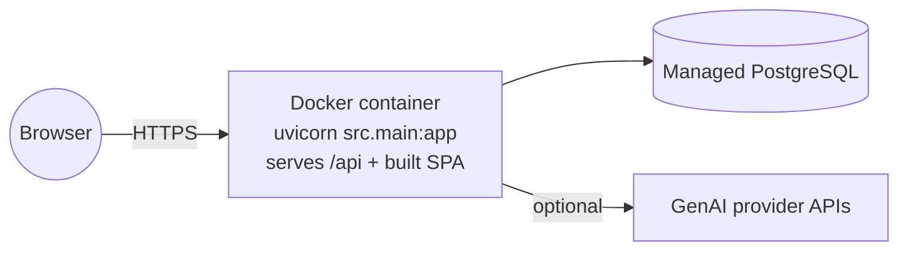

# SupportNova architecture and design report

SupportNova is the NimbusCarta complaint intelligence platform.

- **Pipeline 1** is Generative AI. It reads a complaint and drafts a structured analysis and a reply.
- **Pipeline 2** is Python. It independently works out the correct answer from approved rules and policies, checks Pipeline 1 against it, and decides what a human must review.

GenAI never approves its own output. This document describes the architecture, data flows, use cases, activities, sequences and data model. The diagrams are Mermaid, which renders on GitHub.

## 1. System architecture



| Layer | Folder | Responsibility |
|---|---|---|
| Presentation | `frontend/src` | Role-based SPA. The UI hides actions outside the user's role, and the API enforces the same limits. |
| API | `src/api` | REST endpoints, request validation (Pydantic), role guards (`security/auth.py`). |
| Services | `src/services` | Intake, analysis orchestration, access scoping, messaging guard, evaluation. |
| Pipeline 1 | `genai_pipeline`, `prompt_templates`, `schemas` | Prompt rendering, provider calls with fallback, structured JSON. |
| Pipeline 2 | `python_validation`, `complaint_rules`, `routing_rules`, `escalation_rules`, `knowledge_base`, `hallucination_checks`, `comparison_engine` | Rules, retrieval, precedence, eligibility, checks, comparison. |
| Documents | `document_processing` | Validation, PDF/DOCX parsing by numbered section, chunking. |
| Assistant | `chatbot` | Intent routing and extractive, grounded answers (Nova). |
| Data | `database` | Models, idempotent migrations, seed from `complaint_rules/rule_matrix.csv` and `sample_documents/`. |
| Runtime config | `config` | `.env` settings, plus `config/runtime.py` thresholds that are editable live. |
| Security | `security` | JWT + Argon2, prompt-injection detection and wrapping, PII masking, audit log. |

## 2. Data flow diagrams

### Level 0 (context)



### Level 1 (complaint analysis)



## 3. Use cases



| Role | Can | Cannot |
|---|---|---|
| Customer | File, track and reply to their own complaints; rate and close or reopen; ask Nova | See internal notes, other customers, staff pages |
| Agent | Analyze, message, assign and change status on unassigned and own complaints | Override the promise guard, make review decisions, change configuration |
| Reviewer | Everything an agent can, plus all review actions, batch re-analysis and guard override (audited) | Configuration |
| Manager | All complaints, analytics, reports, evaluation | Configuration |
| Administrator | Everything, plus documents, rules, thresholds, users | — |

## 4. Activity: complaint lifecycle



## 5. Sequences

### Analyzing a complaint



### Sending a reply



### Hidden policy update

```mermaid
sequenceDiagram
  actor Admin
  participant KB as /knowledge-base/documents
  participant Impact as policy_change_impact
  actor Reviewer
  Admin->>KB: upload DEL-POL-04 v3.0 (active)
  KB->>KB: validate · parse · chunk · supersede v1.0
  KB->>Impact: diff sections and timelines; rules citing the code; escalation rules naming it
  KB->>KB: flag open complaints that relied on it (needs_reanalysis)
  KB-->>Admin: impact report
  Reviewer->>KB: POST /complaints/reanalyze-flagged
  KB-->>Reviewer: re-analyzed codes, remaining 0
```

## 6. Data model (core tables)



Other tables:

- `escalation_rules`, `priority_rules`, `sla_policies`;
- `app_settings`, which holds runtime thresholds;
- `prompt_templates`;
- `audit_log`, which is append-only;
- `notification_state`.

The denormalized columns on `complaints` let filters and dashboards run in SQL:

- `category`, `subcategory`, `urgency`, `priority`, `sentiment`;
- `escalation_required`, `pending_review`, `needs_reanalysis`;
- `sla_*`, `first_responded_at`.

They are refreshed by `sync_classification()` after each analysis or review.

## 7. Key design decisions

1. **Python is the ground truth.** Urgency, priority, routing, escalation and eligibility all come from configurable tables. Sentiment is recorded but never read by urgency logic (`urgency_basis` in checks).
2. **Policy precedence.** An active policy beats a compliance document, which beats SLA, SOP, escalation, routing, guideline, template and then FAQ (`knowledge_base/precedence.py`). Superseded, draft and expired documents are never the primary basis.
   - When a lower-ranked document states a different timeline, rate or automatic entitlement, `resolve_precedence` records the conflict. For example, the FAQ says card refunds can be instant, while REF-POL-01 says 7–10 business days.
   - A complaint or draft reply that relies on the lower-ranked statement is flagged `lower_precedence_conflict` and goes to review.
3. **Eligibility is conditional.** The rule says whether a remedy can apply. `python_validation/eligibility.py` then checks the policy conditions: the 30-day replacement window, product condition, prior replacements, the return window and the warranty. Anything it cannot verify is listed as "needs check", never guessed.
4. **Untrusted input.** Complaint text and uploaded documents are wrapped as data, scanned for injection, and never obeyed. Nova refuses injection attempts and filters staff-only content for customers.
5. **Nothing fabricated.** Without GenAI, scores are `null`, GenAI columns read "not run", and the Python sentiment is labelled as an estimate.
6. **Live configuration.** Categories, subcategories, departments, rules (create, edit, toggle), escalation rules, the priority table, SLA targets and thresholds all change at runtime and are audited.
7. **Hidden data readiness.** Complaint packs import through the Evaluation page. Policy documents upload with a change-impact report and a batch re-analysis.

## 8. Deployment



- `Dockerfile` builds the React app and runs FastAPI. FastAPI serves the SPA from the same origin, so no CORS setup is needed.
- `render.yaml` provisions the web service and the database, and generates `SECRET_KEY`.
- Hosted `postgres://` URLs are converted to the psycopg driver automatically.
- For local setup without Docker, see `documentation/INSTALLATION.md`.
