# SupportNova walkthrough: from complaint to closure

This document follows one real complaint through the application, step by step, as each role would see it. Every screenshot was taken from the running app by `scripts/walkthrough/walkthrough.mjs`, which drives Chrome through the actual UI. Nothing is mocked. Run it again at any time to regenerate the images; see [Re-running](#re-running-this-walkthrough).

| | |
|---|---|
| **Complaint** | CMP-00009, "Tablet arrived with a cracked screen" |
| **Order** | NC-768565, NimbusTab 11, PKR 89,999 |
| **Customer** | Demo Customer (a new account registered for this run) |
| **Attachments** | invoice (PDF), photo of the damage (JPG), courier delivery note (DOCX) |
| **Pipeline 1 (GenAI)** | Ollama · qwen2.5:3b · prompt v3. The hosted providers were out of credit, so the local fallback answered. |
| **Pipeline 2 (Python)** | Rule RR-006 · policy WAR-POL-03 §2.2 |
| **Outcome** | Replacement approved by a reviewer, resolved by the agent, closed by the customer with ★★★★★ |

**Roles used:**

| Role | Account | Password |
|---|---|---|
| Customer | registered during the run | — |
| Agent | agent@nimbuscarta.example | AgentPass!23 |
| Reviewer | reviewer@nimbuscarta.example | ReviewPass!23 |
| Manager | manager@nimbuscarta.example | ManagerPass!23 |
| Administrator | admin@nimbuscarta.example | ChangeMeNow!23 |

**The flow at a glance:**


```mermaid
flowchart LR
  A[1-4 Customer files<br/>with 3 attachments] --> B[5 Customer tracks<br/>and asks Nova]
  B --> C[6-12 Agent analyzes:<br/>Python + GenAI + evidence]
  C --> D[13-14 Agent replies<br/>through the promise guard]
  D --> E[15 Customer answers]
  E --> F[16 Reviewer approves]
  F --> G[17 Agent resolves]
  G --> H[18 Customer confirms<br/>and rates]
  H --> I[19-21 Audit, reports,<br/>knowledge base, settings]
```

---

## Part A · The customer files a complaint

### Step 1 · Sign in

**Who:** anyone. **Screen:** `/login`.

- **What you do:** enter your email and password and click **Sign in**.
- **Behind the scenes:**
  - `POST /api/v1/auth/login-json` checks the Argon2 password hash and returns a JWT that carries the role.
  - Five wrong passwords in 5 minutes lock that account for 5 minutes (HTTP 429).
- **Result:** the role decides the menu and the pages you can open. The API enforces the same limits.

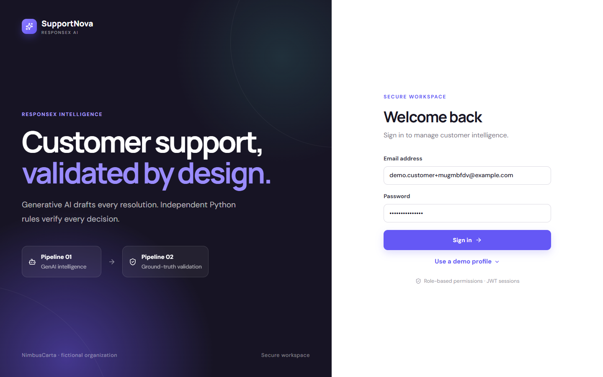

### Step 2 · Customer dashboard

**Who:** customer. **Screen:** `/`.

- **What you see:** your complaints, their statuses and any unread messages. Nothing internal (analysis, flags, other customers) is ever shown.
- **Behind the scenes:** `GET /api/v1/dashboards/customer` returns only complaints linked to this customer.

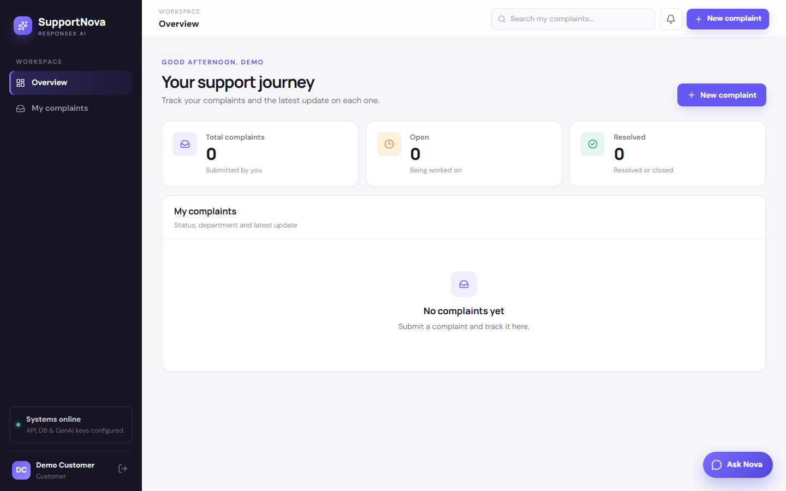

### Step 3 · Complaint wizard, part 1: what happened

**Who:** customer. **Screen:** **New complaint** → `/complaints/new`.

- **What you do:** enter a title, a description of at least 20 characters, the product, and the order number (format `NC-000000`, checked as you type).
- **In this run:** *"My NimbusTab 11 was delivered two days ago with the screen cracked across the middle. The box corner was dented and the courier noted it on the delivery note…"*, NimbusTab 11, NC-768565.

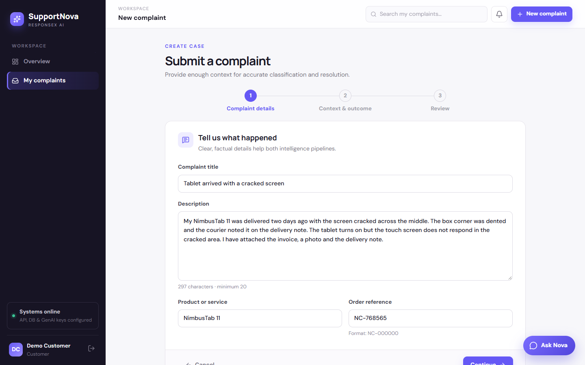

### Step 4 · Complaint wizard, part 2: context and attachments

- **What you do:** set the incident date, preferred contact and requested resolution (*"Please replace the tablet."*), and attach supporting files: PDF, DOCX, PNG, JPG or TXT, up to 15 MB each.
- **In this run:** three files.

| File | What it is | What the system reads from it |
|---|---|---|
| `invoice_NC-768565.pdf` | NimbusCarta tax invoice | order **NC-768565**, amount **PKR 89,999**, invoice date **2026-09-16** |
| `photo_cracked_screen.jpg` | photo of the cracked screen | counts as photo evidence; 1200×800, camera date 18 Sep |
| `delivery_note.docx` | courier note: "received damaged" | text (157 characters), order number, delivery date |

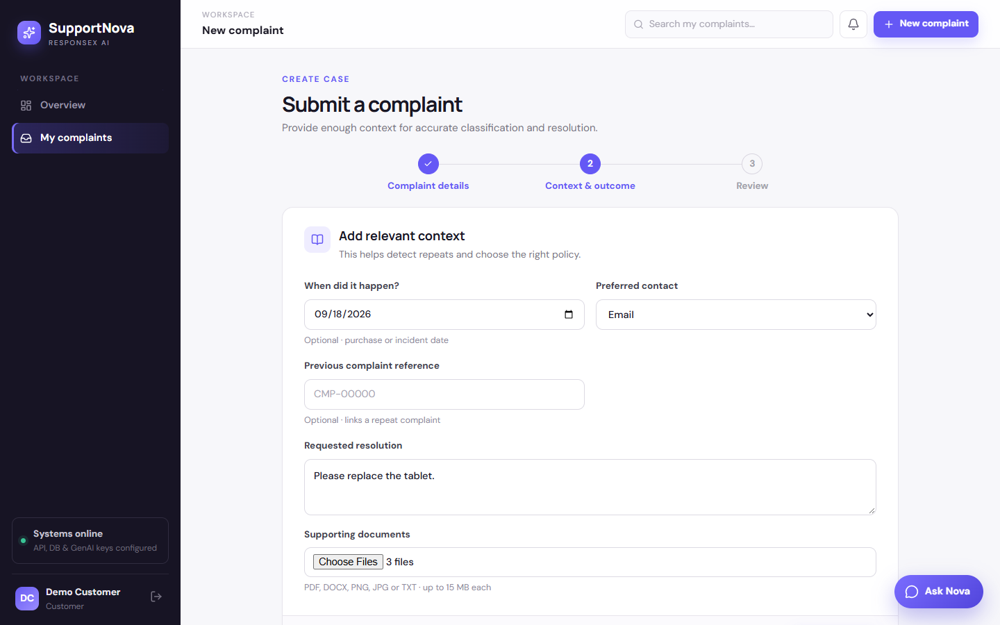

### Step 5 · Review and submit

- **What you do:** check everything, including "Attachments 3", then click **Submit complaint**.
- **Behind the scenes:**
  1. **Intake:** `POST /api/v1/complaints` (`src/services/intake.py`):
     - validates the fields and sanitizes the text (angle brackets are stripped);
     - checks for an exact duplicate from *this* customer (HTTP 409) and near-duplicates (linked for review);
     - stores the complaint with status **Submitted** and the next free code, **CMP-00009**.
  2. **Attachments:** each file goes to `POST /api/v1/complaints/9/attachments`:
     - its type and signature are checked (a renamed `.exe` is refused), then it's stored under `uploads/complaints/9/`;
     - **it is read straight away** (`document_processing/attachments.py`): PDF text via PyMuPDF, DOCX via python-docx, image size and EXIF date via Pillow;
     - order numbers, amounts, dates and any instruction-like text are pulled out and saved with the file.

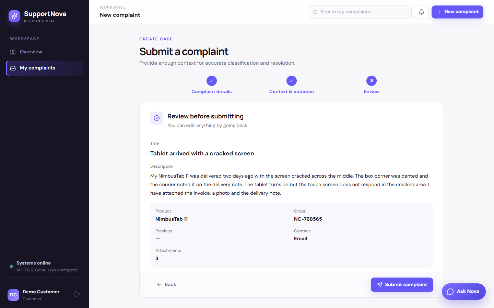

### Step 6 · The submitted complaint

**Who:** customer. **Screen:** `/complaints/9`.

- **What you see:** status, department ("Being assigned" until analysis), target resolution time, your complaint as submitted, the three files under **Supporting documents**, and the **Messages** panel.

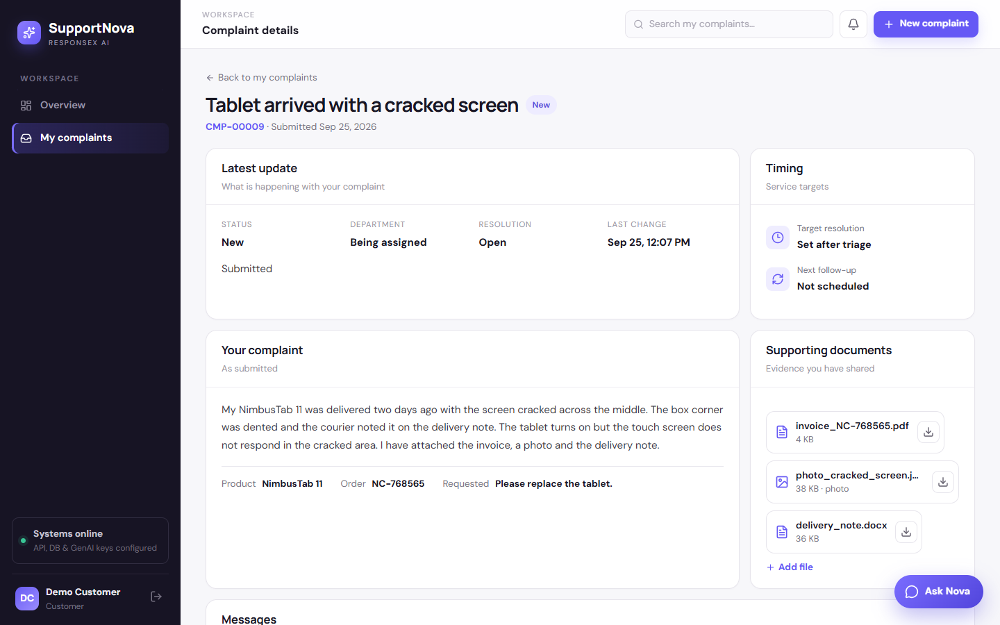

### Step 7 · Opening an attachment

- **What you do:** click a file. Images and PDFs open in a preview, text files are shown as text, and Word files download. **Download** saves any file.
- **Behind the scenes:**
  - `GET /api/v1/complaints/9/attachments/{id}` serves the file only to the customer who filed the complaint and to staff. Other customers get 403, and anyone signed out gets 401.
  - Files are sent with `nosniff` and `Content-Security-Policy: sandbox`, so an uploaded file can never run as part of the app.

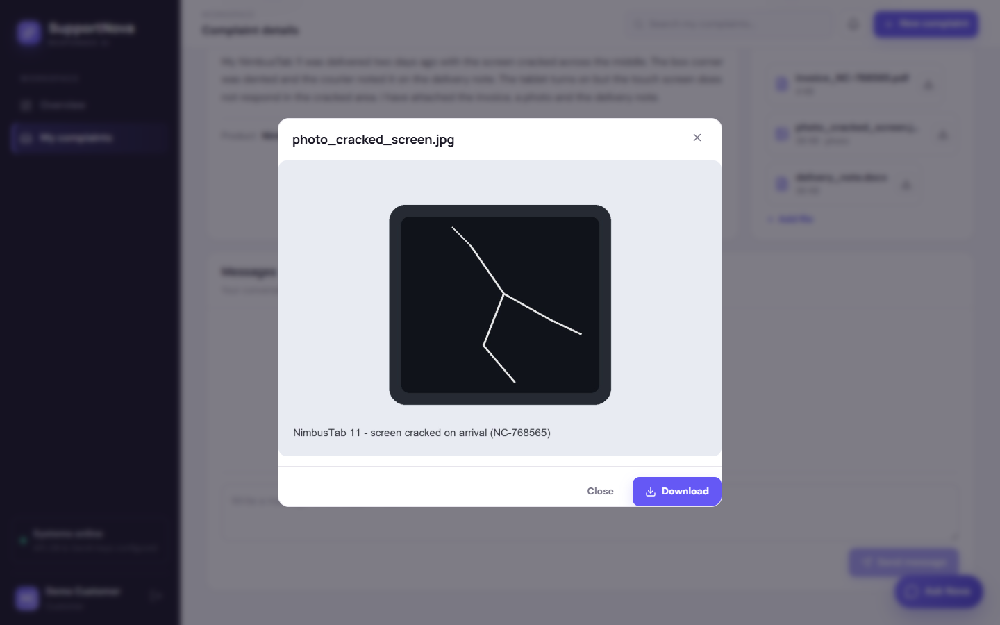

### Step 8 · Asking Nova

- **What you do:** click **Ask Nova** and ask *"What is the status of CMP-00009?"*.
- **Behind the scenes:**
  - `POST /api/v1/assistant/chat` routes the question to the *track* intent and answers only from this customer's own complaints.
  - Policy questions are answered from the approved knowledge base with citations. Prompt-injection attempts are refused.

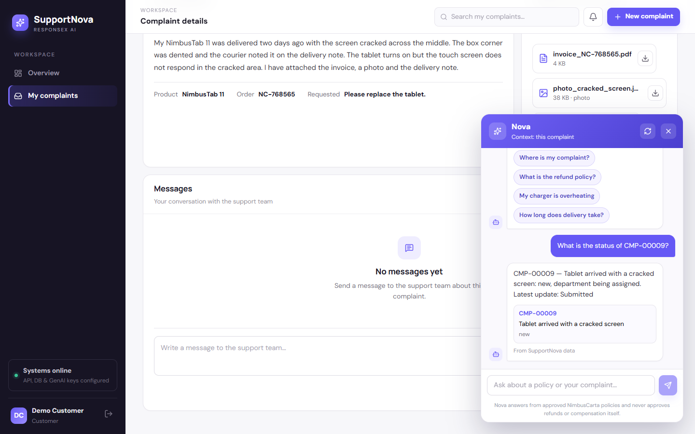

---

## Part B · The agent analyzes

### Step 9 · Agent dashboard

**Who:** agent (Amina Agent). **Screen:** `/`.

- **What you see:** unassigned cases and your own cases, SLA risk, escalations, and the review count.

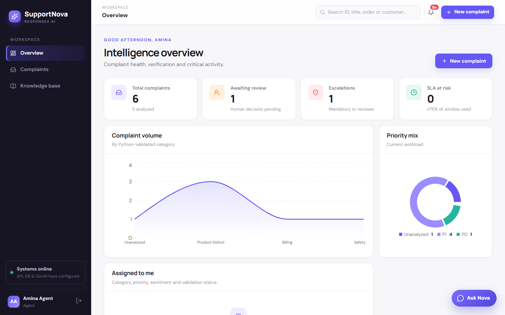

### Step 10 · Complaint list

**Screen:** `/complaints`.

- **What you see:** every complaint you may work on, newest first.
- **Filters:** category, department, priority, urgency, sentiment, escalation, SLA risk, awaiting review, re-analysis needed, and date range. All filtering and paging run in SQL, and the total count comes back in `X-Total-Count`.

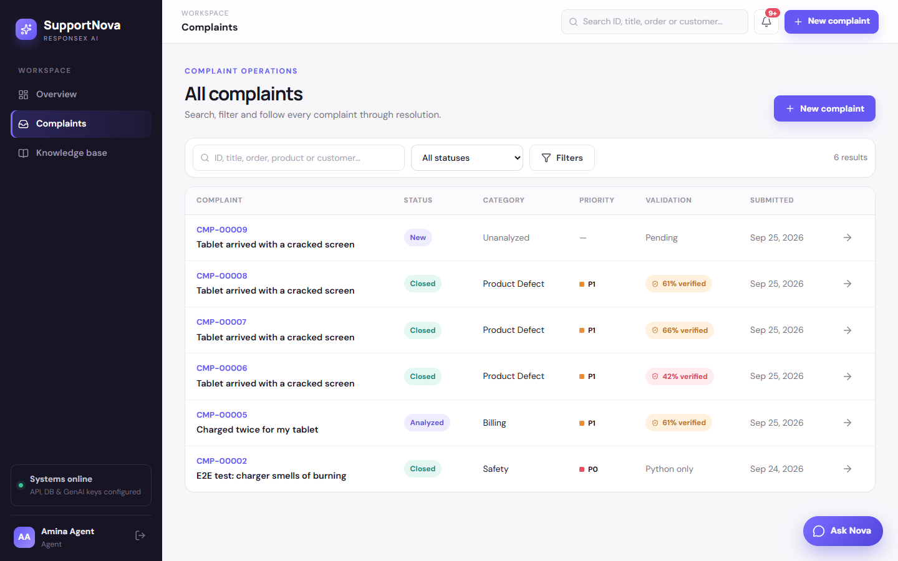

### Step 11 · Before analysis

**Screen:** `/complaints/9`.

- **What you see:** the original text (marked *untrusted input*), the metadata and the attachments, plus the tone selector, **Python only**, and **Analyze complaint**.

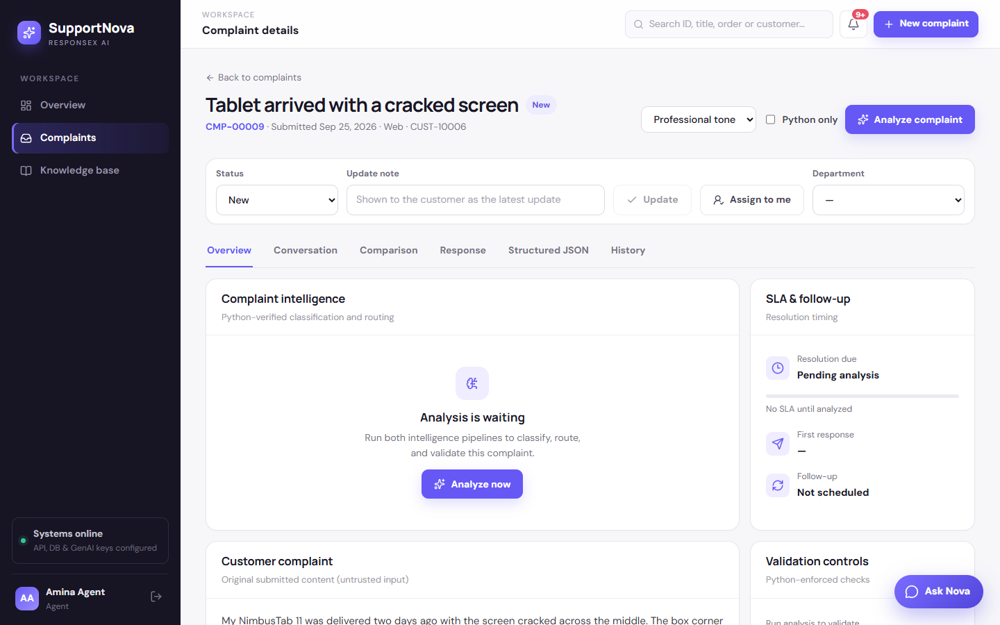

### Step 12 · Analysis: both pipelines run

- **What you do:** click **Analyze complaint**. In this run it took **29 seconds**, 24 of them in the local model.
- **Behind the scenes:** `POST /api/v1/complaints/9/analyze` runs these stages.

| Stage | What happened for CMP-00009 |
|---|---|
| Repeat / duplicate check | none: a new customer and a new order |
| **Pipeline 2: rule match** | RR-006 → **Product Defect / Damaged Product**; secondary issues *Delivery / Delayed Delivery* and *Billing / Incorrect Charge*; department **Warranty**, supporting **Logistics, Billing** |
| Escalation rules | none matched; amounts from the invoice (PKR 89,999) are below the 200,000 high-value threshold |
| Urgency / priority | **high → P1** from the rule and the priority table (sentiment is never used) |
| Policy | **WAR-POL-03 §2.2 v1.0**, *Applicable*; precedence: WAR-POL-03 governs |
| Eligibility | replacement **eligible** (see step 13); refund *needs check*; compensation *not eligible* |
| **Attachment evidence** | the invoice supplied the purchase date, the order number (matches the complaint) and the amount; the photo satisfied the rule step *"Request unboxing photos"* |
| **Pipeline 1: GenAI** | provider chain OpenAI → xAI → Gemini (all out of credit or paused) → **Ollama qwen2.5:3b**, prompt **v3**, valid JSON on attempt 1. The prompt contained the complaint and the attachment facts and excerpts, PII-masked and wrapped as *untrusted data*. |
| Comparison | category, subcategory family, urgency, priority and policy **match**; department (*Returns* vs *Warranty*) and escalation (*supervisor review* vs *not required*) **mismatch** → verification **52%** |
| Review decision | **Manual review required**: *Complaint is ambiguous* (three issues in one complaint) · *GenAI and Python disagree significantly* |
| SLA | resolution due in 12 h (P1); first response due in 1 h; follow-up scheduled |

The Python result is authoritative. GenAI's disagreements don't change it; they only decide whether a human looks first.

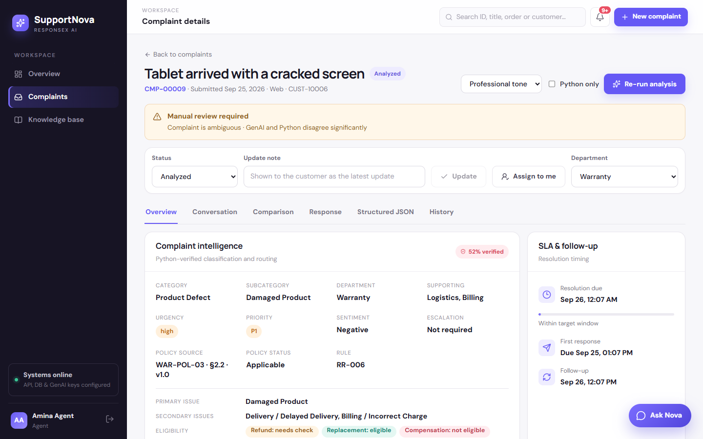

### Step 13 · Eligibility against the policy conditions

- **What you see:** the rule says a replacement is possible. **Policy conditions** then shows each check from RPL-POL-01 and WAR-POL-03:
  - ✓ **Replacement window:** 7 days since purchase/delivery (limit 30), RPL-POL-01 §1.
  - ⚠ **Product condition:** to be confirmed on inspection (can't be decided from the file).
  - ✓ **No previous replacement** on this order, RPL-POL-01 §2.
- **If no date had been entered:** the invoice date would be used instead, and the check would say "since attached invoice".

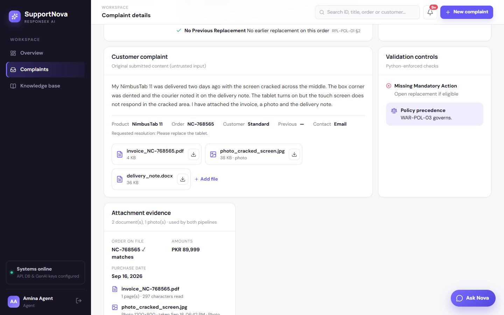

### Step 14 · Attachment evidence

- **What you see:** the **Attachment evidence** panel:
  - Order on file: NC-768565 ✓ matches.
  - Amount: PKR 89,999. Purchase date: 16 Sep 2026.
  - Each file, with what was read from it. The photo is shown as photo evidence, because image content isn't machine-read, so staff view it before deciding.
- **How the evidence is used:**

| Where | How |
|---|---|
| Missing information | *evidence*, *order number* and *purchase date* are no longer asked for when an attachment provides them |
| Eligibility | the invoice date stands in for a missing purchase date |
| Mandatory steps | "Request unboxing photos" is marked *already provided* instead of being flagged as missing |
| Escalation | amounts on invoices and statements count toward the high-value threshold |
| Consistency | an attachment for a *different* order raises `attachment_order_mismatch` |
| Security | instruction-like text inside a file raises `prompt_injection_in_attachment` and sends the case to review |
| GenAI prompt | file facts plus a 1,500-character PII-masked excerpt, wrapped as untrusted data; the draft reply acknowledged *"your invoice, photo, and delivery note"* |
| Hallucination check | IDs and amounts copied from an attachment count as grounded, not invented |

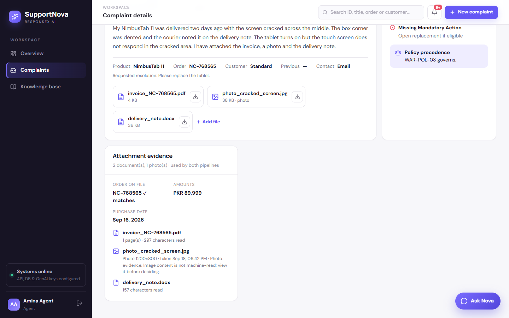

### Step 15 · Validation controls and policy precedence

- **What you see:** every flag Python raised. Here that's *Missing mandatory action: Open replacement if eligible*, because the GenAI plan didn't include that rule step.
- **Policy precedence:** WAR-POL-03 governs, so a FAQ or older version can't override it.

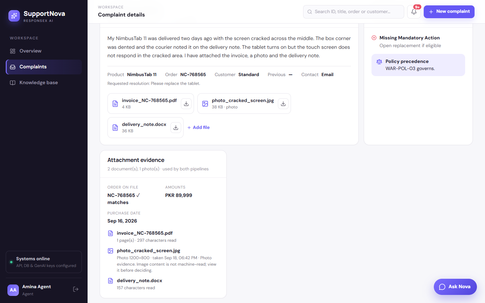

### Step 16 · Comparison: GenAI vs Python, field by field

- **What you see:** each field side by side, marked **Match** or **Mismatch**. Mismatches lower the verification score and decide the review.

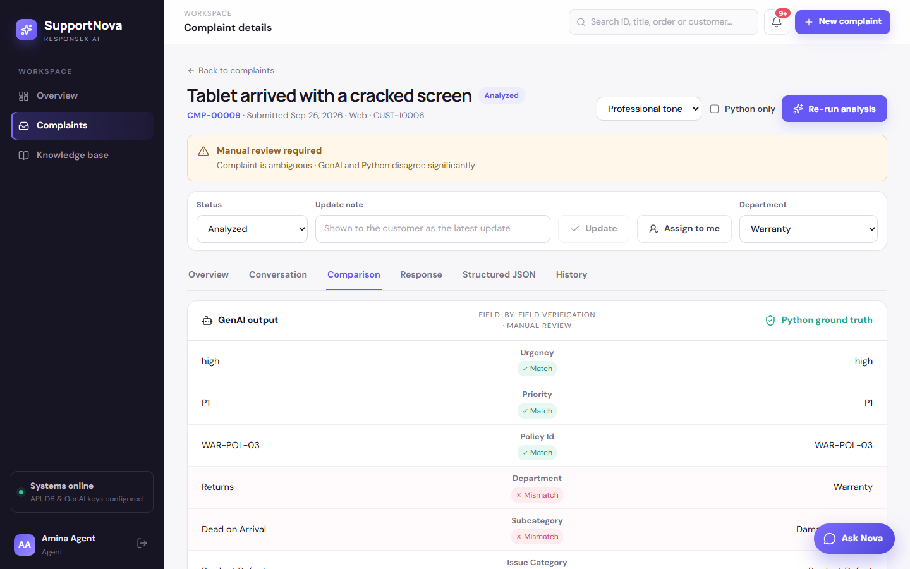

### Step 17 · Draft reply and guidance

- **What you see:** the GenAI draft, with provider, model and prompt version.
  - *"Dear customer, we understand your concern about the damaged tablet. We have received your invoice, photo, and delivery note. We will review the policy and take the necessary steps…"*
- Also shown: follow-up text, clarification questions, GenAI's recommended steps, and Python's **mandatory** and **prohibited** actions (*"Approve refund before inspection"* is prohibited).

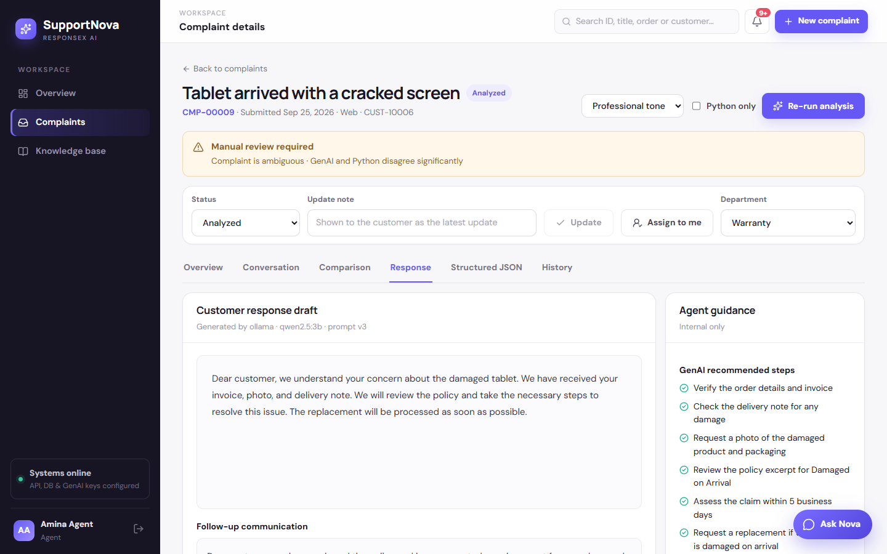

### Step 18 · Structured JSON

- **What you see:** the exact schema-validated JSON from both pipelines, stored with provider, model, prompt version and the policy versions used. This is the evidence for SRS Deliverable 6.

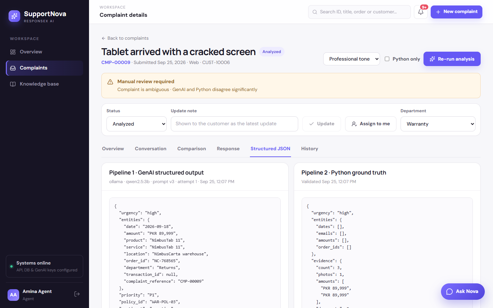

---

## Part C · Working the case

### Step 19 · An unsafe reply is blocked

**Who:** agent. **Screen:** **Conversation** tab (after **Assign to me**).

- **What you do:** type *"We are very sorry. We will send you a brand new tablet and a PKR 5,000 voucher within 24 hours."* and click **Send reply**.
- **Behind the scenes:** `POST /complaints/9/messages/check` runs the promise guard (`src/services/messaging.py`):
  - *Unsupported timeline*: "within 24 hours" isn't in the governing policy;
  - *Ungrounded amount*: PKR 5,000 isn't in the complaint, its attachments or the policy;
  - *Payment promise*: a voucher, when compensation isn't permitted.
- **Result:** the reply is **not sent**. Agents can't override the guard. Reviewers can, and every override is audited.

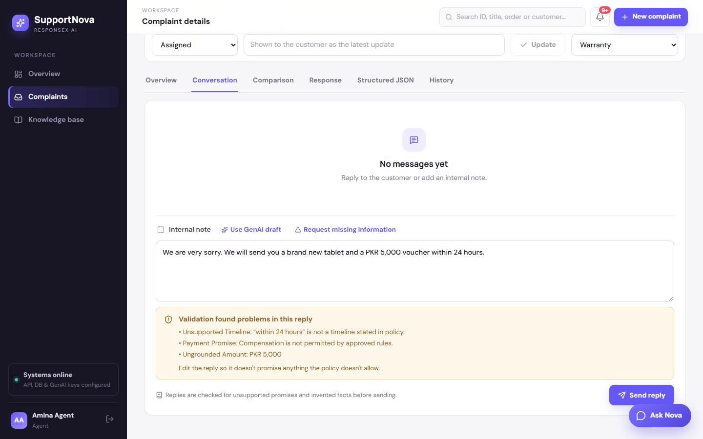

### Step 20 · A policy-safe reply is sent

- **What you do:** send *"Thank you for the invoice, the photo and the delivery note. We are sorry the tablet arrived damaged. Your case is with our Warranty team, who will check the evidence against the replacement policy and update you here."*
- **Result:**
  - The message is delivered as **NimbusCarta Support**, and the first-response time is recorded as *on time*.
  - **Request missing information** would send the configured questions instead and set the status to *awaiting customer*.

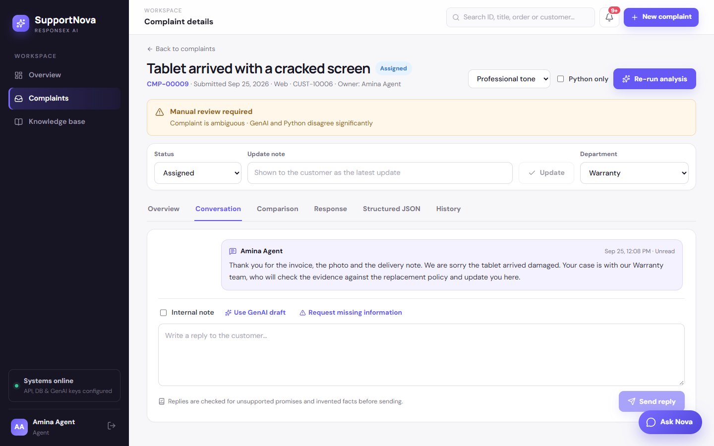

### Step 21 · The customer answers

**Who:** customer.

- **What you see:** the reply under **Messages**, and a bell notification.
- **In this run:** the customer answers *"Thank you. I still have the original box if you need it collected."*. Internal notes never appear here.

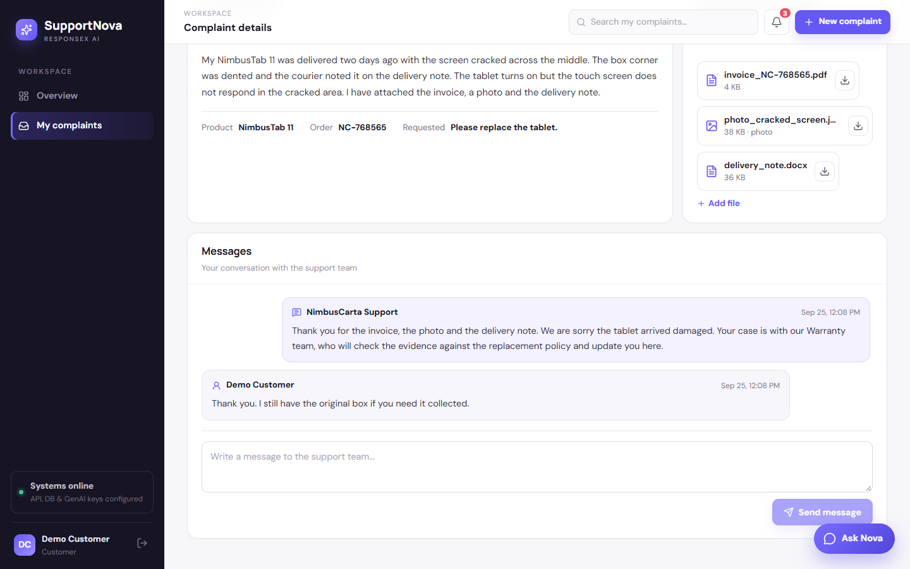

---

## Part D · Human oversight

### Step 22 · Manual review queue

**Who:** reviewer (Rafi Reviewer). **Screen:** `/review`.

- **What you see:** the case with its reasons (*Complaint is ambiguous*, *GenAI and Python disagree significantly*, *Missing mandatory action*), and the GenAI recommendation next to the Python ground truth.
- **Available actions:** Approve, Reject, **Modify** (edit fields and the customer response), Reclassify, Reassign, Escalate, Regenerate, Comment.

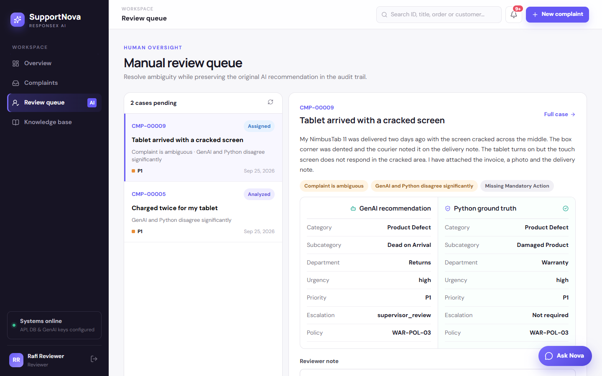

### Step 23 · Reviewer approves

- **What you do:** add a note (*"Photo and delivery note confirm damage on arrival within the replacement window. Approve the Python recommendation."*) and click **Approve**.
- **Result:**
  - The case leaves the queue and moves to *In progress*.
  - The original recommendation and the decision are both stored (`review_actions`) and audited.

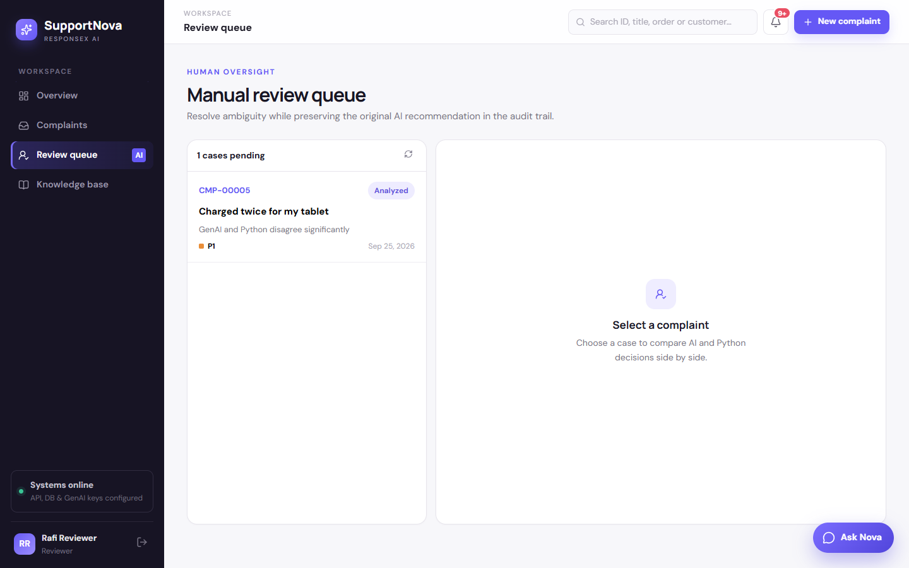

### Step 24 · Agent resolves

**Who:** agent.

- **What you do:** set the status to **Resolved** with an update note: *"A replacement NimbusTab 11 has been approved under RPL-POL-01 after the photo and delivery note were checked. The courier will collect the damaged unit."*
- **Result:** the note becomes the customer's latest update, open follow-ups are completed, and a resolution-confirmation follow-up is scheduled.

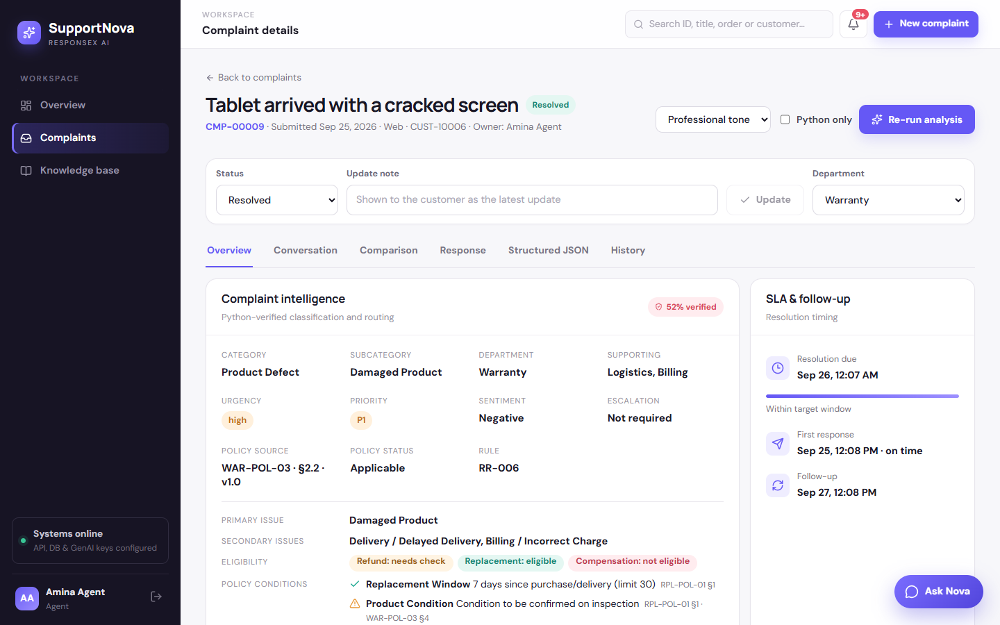

### Step 25 · "Did this resolve your issue?"

**Who:** customer.

- **What you see:** the question at the top of the complaint. **Yes, close it** takes an optional 1–5 star rating; **Not resolved, reopen** needs a reason.
- **If the customer reopens:** the case is marked as a repeat and the agent is alerted.

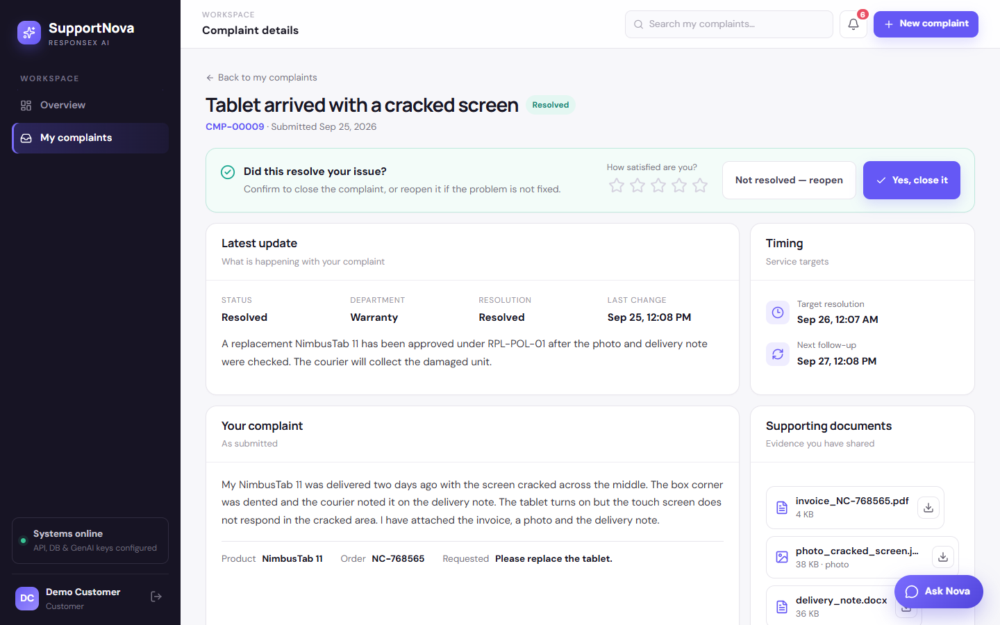

### Step 26 · Closed with a rating

- **What you do:** give 5 stars and click **Yes, close it**.
- **Result:** status **Closed**. The rating is stored as CSAT and shows on the Reports page, and nothing further is scheduled.


---

## Part E · Oversight and administration

### Step 27 · Audit trail

**Who:** staff. **Screen:** complaint → **History**.

- **Every action is logged, in order:** submit → 3 attachments → analyze → assign → message to customer → message from customer → review approve → status → customer confirm.
- **Also shown:** the GenAI runs (ollama · qwen2.5:3b · prompt v3 · attempt 1 · 23.9 s), reviewer decisions with the original recommendation, and follow-ups.

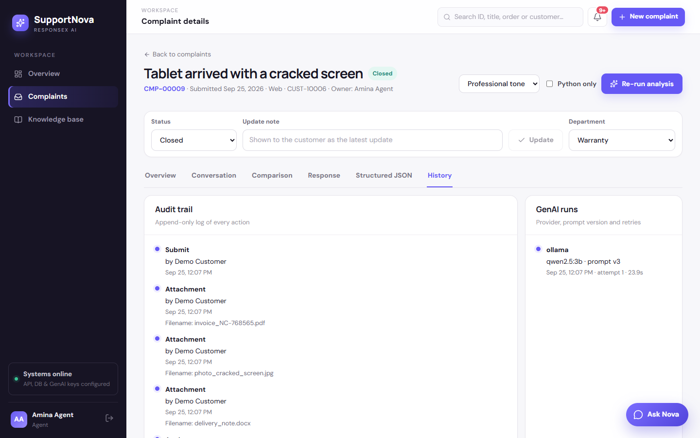

### Step 28 · Reports and analytics

**Who:** manager. **Screen:** `/reports`.

- **What you see:**
  - agreement rate, average verification, SLA compliance and resolution time;
  - department workload and detected trends (e.g. *"Rising product defect complaints"*);
  - 14-day volume, categories, products, sentiment and CSAT;
  - eight reports exportable as CSV, Excel or PDF.

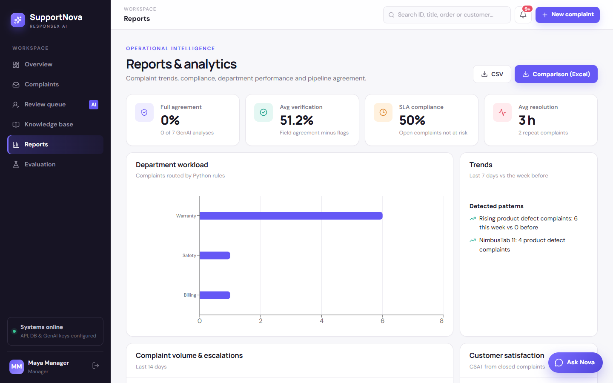

### Step 29 · Evaluation workbench

**Screen:** `/evaluation`.

- **What you do:** upload a hidden complaint pack (CSV/JSON, optionally with expected labels).
- **Result:** both pipelines run on every row. You get accuracy per field and per case type, every mismatch, and the SRS comparison report. See `hidden_test_ready/README.md`.

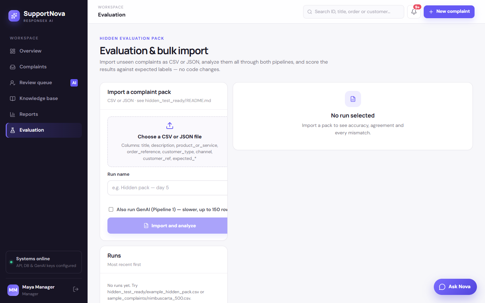

### Step 30 · Knowledge base

**Who:** administrator. **Screen:** `/knowledge`.

- **What you see:** versioned policies, SOPs and FAQs, parsed into numbered sections with page numbers.
- **When you upload a new version:** it supersedes the old one. It also produces a **change-impact report** (sections and timelines changed, rules citing missing sections, affected open complaints) with **Re-analyze affected**.

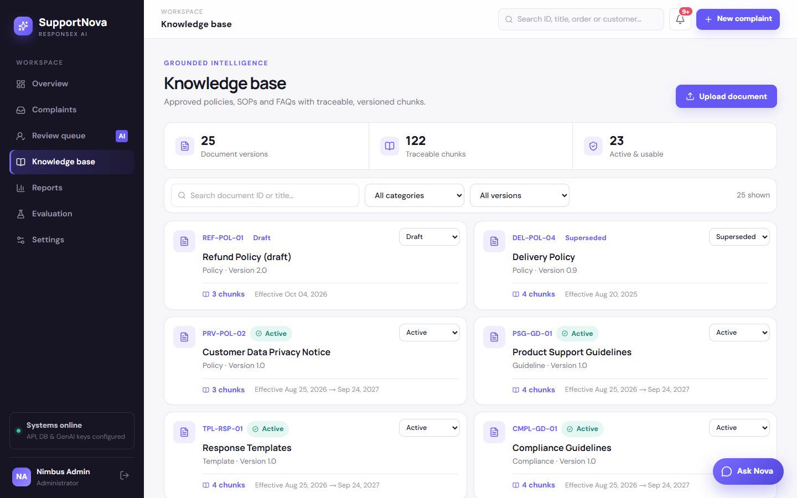

### Step 31 · Settings

**Screen:** `/settings`.

- **What you see:**
  - **Pipelines:** the provider chain (here ending in `ollama (qwen2.5:3b · local)`), prompt version, failure strategy, and **Resume** for paused providers.
  - **Also editable:** the high-value and repeat thresholds, resolution rules (create, edit, toggle), escalation rules, categories and subcategories, departments, SLA targets, the priority table and users.
- **Every change** is audited and applies to the next analysis without a restart.

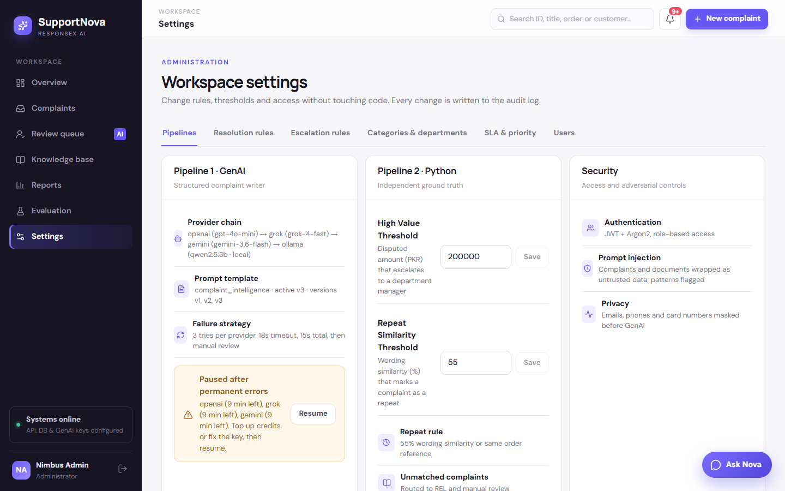

---

## Status timeline for CMP-00009

| # | Status | Set by | Trigger |
|---|---|---|---|
| 1 | Submitted | customer | wizard submit |
| 2 | Analyzed | agent | Analyze complaint (both pipelines) |
| 3 | Assigned | agent | Assign to me |
| 4 | In progress | reviewer | Approve in the review queue |
| 5 | Resolved | agent | status update with note |
| 6 | Closed | customer | "Yes, close it", 5★ |

## Notes and limits seen in this run

- **GenAI provider.** OpenAI, xAI and Gemini were out of credit or had invalid keys, so they were paused after one failed call each. Local Ollama answered. A hosted provider (for example Groq with `GROQ_API_KEY`) would normally answer much faster than a local CPU/GPU model; it's tried before Ollama once a key is set.
- **Model quality.** The 3B model got category, urgency, priority and policy right, but chose *Returns* over *Warranty* and asked for escalation. Python caught both, which is exactly why the case went to review.
- **Photos.** Images are stored, previewed and counted as evidence, but their content isn't machine-read (no OCR or vision model). Staff view the photo before deciding. A vision model can be added later without changing the evidence model.
- **Dev data.** The run adds one customer and one complaint to the database each time.

## Re-running this walkthrough

Start the database, the API (port 8000), the web app (port 5173) and Ollama. Then run:

```bash
node scripts/walkthrough/walkthrough.mjs
```

- Each run registers a new demo customer and creates a new order number with matching attachments (`scripts/walkthrough/make_attachments.py`).
- It overwrites `documentation/walkthrough/images/` and writes `facts.json`, which holds the analysis values quoted above.
- If a run stops partway, `RESUME=5 node scripts/walkthrough/walkthrough.mjs` continues from section 5 with the same complaint.
